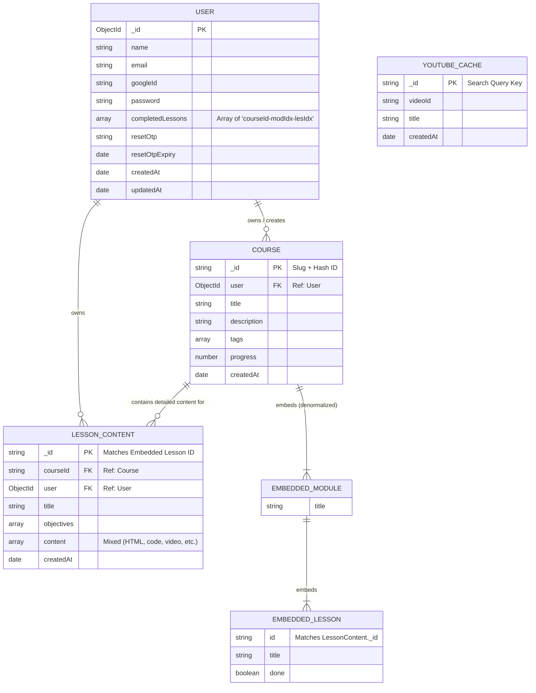

# 🚀 Text-To-Learn

## 📖 Overview

**Text-To-Learn** is a full-stack web application designed to solve information overload. Instead of reading through wall-of-text documents, users can paste dense text and automatically generate structured, multi-module learning paths. Complete with lesson breakdown objectives, video embeds fetched dynamically from YouTube, progress tracking, and secure OAuth authentication.

## 🎥 Demo & Walkthrough

▶️ **[Watch Video Walkthrough on YouTube](https://www.youtube.com/watch?v=nMovZ7itz2I)**

---

## ✨ Key Features

* 🧠 **AI-Powered Course Generation:** Utilizes the Google Gemini API to parse text, outline modules, summarize objectives, and format interactive lesson content.

* 📄 **PDF Export:** Allows users to download complete courses or individual lessons as formatted PDF documents for offline studying.

* 🎧 **Multilingual Audio Summaries:** Generates multi-language audio recaps of lesson content for hands-free and accessible learning.

* 📺 **Automated Video Embeds:** Integrates the YouTube Data API v3 to pair lessons with relevant educational videos, featuring a caching layer to conserve API quota.

* 🔐 **Authentication & Security:** Supports Google OAuth2 sign-in and email/password authentication using HTTP-only JWT cookies and bcrypt password hashing.

* 📚 **Course Library Dashboard:** Centralized library view (`/courses`) where users can save, organize, browse, and track completion progress across all generated courses.

* ✉️ **Transactional Emails:** Integrated Brevo email service for sending user notifications and OTP password resets.

* 🔄 **Automated CI/CD Pipeline:** Gated GitHub Actions workflows that automatically run logic checks and trigger hosting deploy hooks (Vercel & Render).

## 🏗️ Architecture & Tech Stack

### Monorepo Structure

```
Text-To-Learn/
├── client/   # React + Vite Frontend (Deployed on Vercel)
└── server/   # Node.js + Express REST API (Deployed on Render)
```

### Core Technologies

| Layer | Technology | Description | 
| ----- | ----- | ----- | 
| **Frontend** | React, React Router v6, Tailwind CSS | Responsive SPA with custom theme and seamless routing. | 
| **Backend** | Node.js, Express.js, Mongoose | Scalable REST API handling auth, course logic, and third-party integrations. | 
| **Database** | MongoDB Atlas | Cloud document store for users, courses, lesson content, and video caches. | 
| **AI Engine** | Google Gemini API | Context parsing and structured JSON lesson generation. | 
| **Media & Audio API** | YouTube Data API v3,Google TTS API,Google GenAI | Relevant video discovery per lesson and audio summary playback. | 
| **Document Export** |	@react-pdf/renderer | Dynamic PDF layout and document rendering for downloading course content. |
| **Email API** | Brevo Transactional Email API | Transactional emails and secure password reset OTPs. | 
| **CI/CD** | GitHub Actions, Deploy Hooks | Gated testing and deployment pipeline for frontend and backend. | 

## 📊 Database ER Diagram



## 🛠️ Local Development Setup

### Prerequisites

* [Node.js](https://nodejs.org/) (v18.0.0 or higher)
* [MongoDB Atlas](https://www.mongodb.com/cloud/atlas) database cluster
* [Google Cloud Console](https://console.cloud.google.com/) OAuth credentials and YouTube API Key
* [Google AI Studio Key](https://aistudio.google.com/) for Gemini API access
* [Brevo Account](https://www.brevo.com/) for email API keys

### 1. Repository Setup

```bash
git clone https://github.com/Soumalyakarak/Text-To-Learn.git
cd Text-To-Learn
```

### 2. Environment Configuration

Create `.env` files in both `server/` and `client/` directories:

#### **`server/.env`**

```env
PORT=5000
CLIENT_URL=http://localhost:5173
BACKEND_URL=http://localhost:5000
MONGO_URI=mongodb+srv://your_mongodb_atlas_uri
JWT_SECRET=your_jwt_secret_key
JWT_EXPIRES_IN=7d

BREVO_SENDER_EMAIL=your_email@example.com
BREVO_API_KEY=your_brevo_api_key

GEMINI_API_KEY=your_gemini_api_key
GEMINI_MODEL=gemini-1.5-flash

YOUTUBE_API_KEY=your_youtube_api_key

# Google OAuth Credentials
GOOGLE_CLIENT_ID=your_google_client_id
GOOGLE_CLIENT_SECRET=your_google_client_secret
```

#### **`client/.env`**

```env
VITE_API_URL=http://localhost:5000/api
```

### 3. Running Locally

#### Start Server

```bash
cd server
npm install
npm run dev
```

#### Start Client

```bash
cd client
npm install
npm run dev
```

Open `http://localhost:5173` in your browser to view the application.

## 🔄 Automated Deployment Pipeline

Automated push-triggered builds on hosting platforms are disabled. Instead, deployments are strictly gated by GitHub Actions:

```
Push to main
 ├── Changes in client/  ──>  Run Client Tests  ──> Trigger Vercel Deploy Hook
 └── Changes in server/  ──>  Run Server Tests  ──> Trigger Render Deploy Hook
```

## 🧪 Testing

Run tests and production build verification locally:

```bash
# Test backend application
cd server && npm test

# Verify frontend production build
cd client && npm run build
```

## 👤 Author

**Soumalya Karak**

* GitHub: [@Soumalyakarak](https://github.com/Soumalyakarak)

## 📝 License

This project is [MIT](LICENSE) licensed.